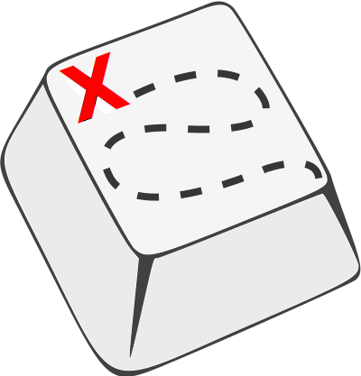

<h1>KeymapDB</h1>

An online and open-source database of keymaps for programmable keyboards, with a focus on QMK ergonomic keyboards, served over a static website at https://keymapdb.com.

Browse a curated collection of full-fledged keymaps like [Miryoku](https://keymapdb.com/manna_harbour) that don't shy away from breaking the conventions dating from the typewriter age.

Looking for something specific? Filter the user-submitted keymaps with the help of the many available options in the sidebar. You can filter by key count, firmware, keyboard, stagger, languages, OS, and more!

Want to add your own keymap to the site? Follow the instructions outlined in “[How to submit a keymap](how_to_submit_a_keymap.md)”.

Want to improve the website code itself? Read “[CONTRIBUTING](CONTRIBUTING.md)” for pointers on how to set up the local dev environment.
